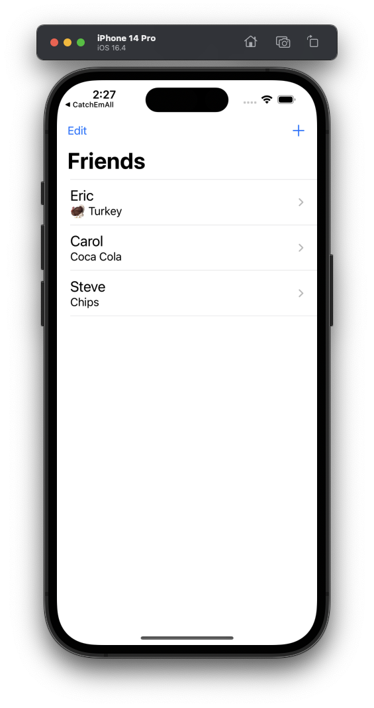
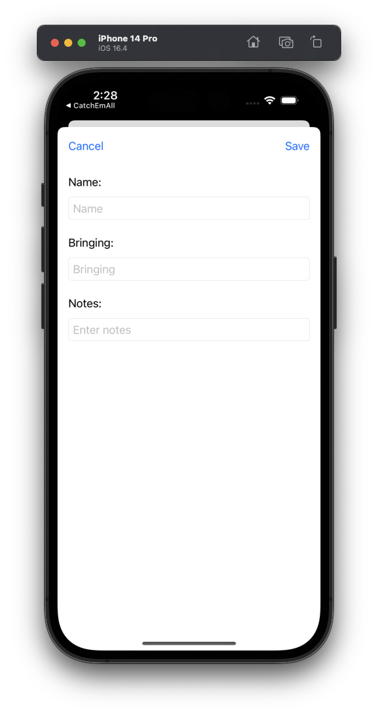
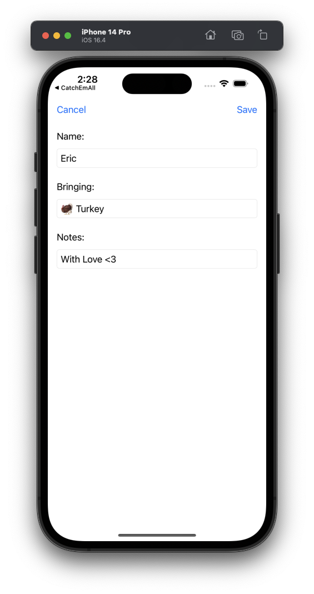

## FriendsGiving

Challenge from Prof John Gallaugher - You'll be building FriendsGiving App to use when planning your own FriendsGiving. 

- Create a list of Friends who came to the party with their bringing and additional notes.
- Get a detailView for each friends.
- Save the data in document directory.

## Screenshots

  
  
  

#### By John Gallaugher
https://bit.ly/prof-g-swiftui
